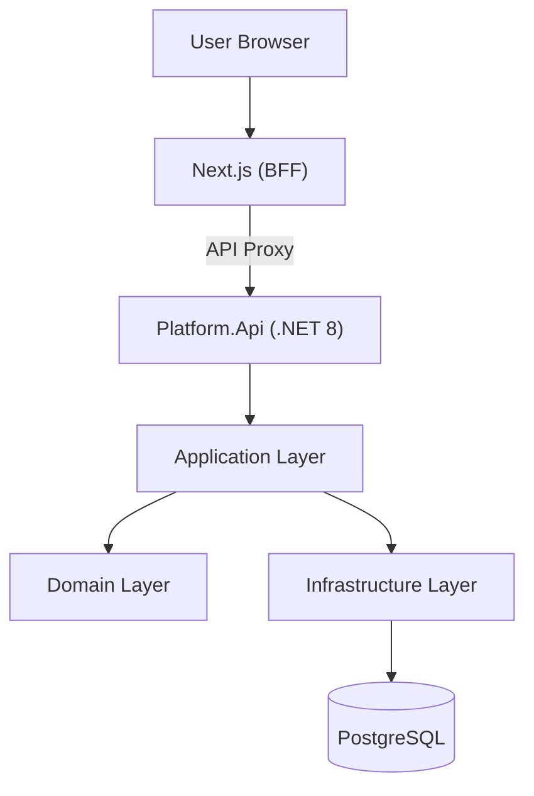

# AI Platform Monorepo

AI 기반 학습 플랫폼의 백엔드(.NET 8) 및 프론트엔드(Next.js)를 포함하는 모노레포 프로젝트입니다.  
확장성을 고려하여 Clean Architecture 기반으로 구성되어 있으며, EF Core + PostgreSQL 마이그레이션까지 초기 세팅을 완료했습니다.

---

## 🏗 Architecture

### High-level Flow



### Layer Responsibilities

#### Next.js (BFF)
- UI Rendering
- API Proxy
- Frontend logic
#### Platform.Api
- HTTP Entry Point
- Dependency Injection
- Endpoints / Swagger
#### Platform.Application
- Use Cases (business workflows)
- DTOs / Service orchestration (planned)
#### Platform.Domain
- Entities, Enums, domain rules (POCO + EF friendly)
#### Platform.Infrastructure
- EF Core DbContext
- PostgreSQL access
- External integrations (planned)

---

### 📂 Project Structure
```
ai-platform-monorepo/
│
├── AiPlatform.sln
│
├── apps/
│   ├── platform/
│   │   ├── Platform.Api/
│   │   ├── Platform.Application/
│   │   ├── Platform.Domain/
│   │   └── Platform.Infrastructure/
│   │
│   └── web/  (Next.js + BFF)
```

---

### 🔧 Tech Stack
#### Backend
- .NET 8
- ASP.NET Core (Minimal API)
- Clean Architecture (Api / Application / Domain / Infrastructure)
- EF Core 8
- PostgreSQL (Docker)

#### Frontend
- Next.js (App Router)
- React
- BFF Pattern (Next.js API routes → .NET API proxy)

---

### 🗃 Database (EF Core + PostgreSQL)
#### Connection String
- 설정 파일 위치:
   - apps/platform/Platform.Api/appsettings.Development.json

예시:
```
{
  "ConnectionStrings": {
    "DefaultConnection": "Host=localhost;Port=5432;Database=app_db;Username=app;Password=app_pw"
  }
}
```
#### Migrations
- 마이그레이션 생성(완료):
```
dotnet ef migrations add InitialCreate --project apps/platform/Platform.Infrastructure --startup-project apps/platform/Platform.Api
```
- DB 반영(완료):
```
dotnet ef database update --project apps/platform/Platform.Infrastructure --startup-project apps/platform/Platform.Api
```

---

### ✅ Available Endpoints
#### Backend (.NET)
- GET /health : API Health Check
- GET /db-check : DB 연결 및 테이블 존재 검증 (Users/Datasets/TrainingJobs 카운트)
db-check는 개발 편의용 엔드포인트이며, 배포 환경에서는 비활성화하는 것을 권장합니다.

#### Frontend (Next.js)
- GET / : Next.js main page
- GET /api/platform/* : BFF proxy routes (Next.js → Platform.Api)

---

### 🚀 Getting Started
#### 1) Backend
```
cd apps/platform/Platform.Api
dotnet run
```

- Swagger (개발환경):
  - http://localhost:<PORT>/swagger

#### 2) Frontend
```
cd apps/web
npm install
npm run dev
```
http://localhost:3000

---
### 📌 Current Status

- Solution 기반 멀티 프로젝트 구조 구성 완료
- Clean Architecture baseline 확정
- EF Core + PostgreSQL 연결 및 Migration 적용 완료
- Next.js 실행 및 BFF proxy 구성 완료
- Health / DB Check 엔드포인트로 동작 검증 완료